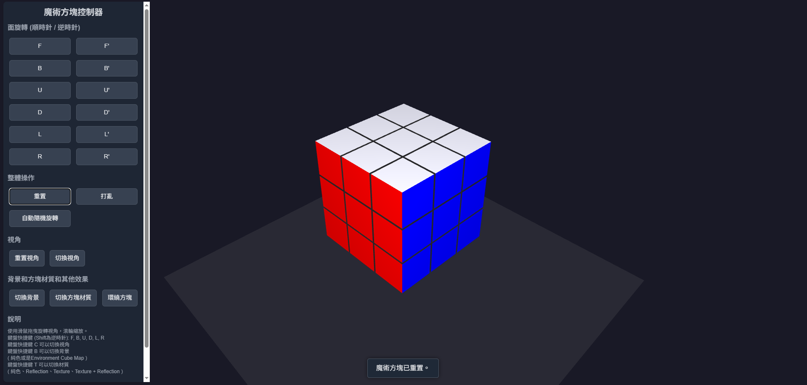

# glCube

`glCube` 是一個基於 WebGL 的 3D 魔術方塊模擬器，提供了豐富的互動功能和視覺效果。該專案支持多種材質模式、相機控制、動畫效果以及天空盒背景。



---

## 功能特性

### 1. 魔術方塊功能
- **旋轉與動畫**：支持魔術方塊的面旋轉動畫，並提供隨機打亂功能。
- **材質模式**：
  - 純色模式
  - 紋理模式
  - 法線貼圖模式
  - 反射模式
- **自動旋轉**：啟用自動隨機旋轉功能。

### 2. 相機控制
- **第一人稱相機**：
  - 支持滑鼠拖動調整視角。
  - 支持滾輪縮放。
- **軌道相機**：
  - 支持滑鼠拖動旋轉。
  - 支持滾輪縮放。
  - 支持重置視角。

### 3. 視覺效果
- **天空盒背景**：支持立方體貼圖作為背景。
- **平台渲染**：魔術方塊下方的平臺渲染。
- **小方塊環繞**：啟用小方塊環繞效果。

---

## 快捷鍵

| 快捷鍵 | 功能                     |
|--------|--------------------------|
| `C`    | 切換相機模式（第一人稱/軌道） |
| `B`    | 切換背景模式（純色/天空盒）   |
| `M`    | 切換反射效果               |
| `E`    | 啟用/禁用自動旋轉           |
| `T`    | 切換材質模式               |
| `O`    | 啟用/禁用小方塊環繞         |


## 開始使用

### 1. 環境需求
- 現代瀏覽器（支持 WebGL）

### 2. 啟動專案
1. 克隆此專案：
   ```bash
   git clone https://github.com/your-repo/glCube.git
   ```